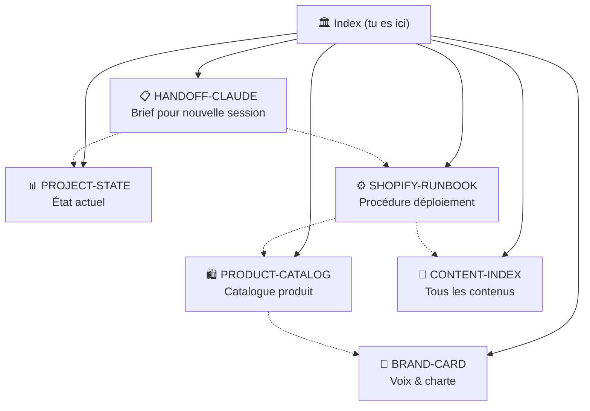

# 🏛 Vault AURÉLIA — Documentation de référence

Ce vault Obsidian contient tous les documents critiques pour reprendre
le projet dans une autre session, transférer à un autre développeur,
ou déployer la boutique en autonomie complète.

> [!info] Marque
> **AURÉLIA Paris** · Masques LED de luminothérapie premium
> Boutique cible : `3aff1g-y4.myshopify.com`
> Repo : `martinbouvet2000-tech/Citation` · branche `claude/cryoglow-ecommerce-shop-mFjYb`

## 🧭 Navigation rapide

Selon ton besoin, ouvre le document adapté :

| Tu veux… | Document |
|---|---|
| Donner un brief complet à une nouvelle session Claude qui pilote ton browser | [[HANDOFF-CLAUDE]] |
| Comprendre l'état actuel du projet (qu'est-ce qui est fait, à faire) | [[PROJECT-STATE]] |
| Déployer pas à pas la boutique sur Shopify (manuel ou semi-auto) | [[SHOPIFY-RUNBOOK]] |
| Connaître la voix de marque, la charte graphique, les valeurs | [[BRAND-CARD]] |
| Avoir le catalogue produit exhaustif (prix, descriptions, tags) | [[PRODUCT-CATALOG]] |
| Trouver tous les contenus rédigés (pages, articles, emails) | [[CONTENT-INDEX]] |

## 🗺 Carte du vault



## 🏷 Tags principaux

- `#aurelia` — tous les docs du projet
- `#handoff` — passation à une autre session
- `#shopify` — tout ce qui touche au déploiement
- `#brand` — voix, palette, typographie
- `#product` — catalogue, fiches, prix
- `#content` — pages, articles, emails
- `#state` — état du projet

## 📁 Structure du repo

```
shopify-theme/              ← le thème Shopify Online Store 2.0
├── assets/                 ← CSS, JS, SVG (logo, favicon, etc.)
├── config/                 ← settings_schema.json, settings_data.json
├── layout/                 ← theme.liquid (template global)
├── locales/                ← fr.default.json
├── sections/               ← 19 sections (hero, header, footer, etc.)
├── snippets/               ← 15 snippets (cart-drawer, popup, etc.)
├── templates/              ← 16 templates de pages
├── email-templates/        ← 5 emails transactionnels
├── BLOG-CONTENT.md         ← 13 articles SEO complets
├── PRODUCT-CONTENT.md      ← 4 fiches produit complètes
├── PHOTO-PROMPTS.md        ← 16 prompts pour visuels (Nano Banana 2)
├── INSTALL.md              ← runbook d'installation (rapide)
└── products.csv            ← import direct produits Shopify

aurelia-theme.zip           ← zip du thème prêt à uploader (154 Ko, 75 fichiers)

vault/                      ← vault Obsidian (tu es dedans)
├── .obsidian/              ← config Obsidian (thème, settings)
├── README.md               ← index (ce fichier)
├── HANDOFF-CLAUDE.md       ← brief pour une nouvelle session Claude
├── PROJECT-STATE.md        ← état actuel exhaustif
├── SHOPIFY-RUNBOOK.md      ← procédure de déploiement détaillée
├── BRAND-CARD.md           ← marque, voix, palette
├── PRODUCT-CATALOG.md      ← catalogue produit
└── CONTENT-INDEX.md        ← index de tous les contenus rédigés
```

## 🔗 Liens externes

- **Repo GitHub** : [Citation](https://github.com/martinbouvet2000-tech/Citation)
- **PR de travail** : [#2 — claude/cryoglow-ecommerce-shop-mFjYb](https://github.com/martinbouvet2000-tech/Citation/pull/2)
- **PR du vault** : [#3 — vault/aurelia-handoff](https://github.com/martinbouvet2000-tech/Citation/pull/3)
- **Boutique Shopify** : `3aff1g-y4.myshopify.com`

## 🚀 Pour reprendre dans une autre session

1. Ouvre [[HANDOFF-CLAUDE]]
2. Sélectionne tout (`Cmd/Ctrl + A`), copie (`Cmd/Ctrl + C`)
3. Colle dans une nouvelle session Claude qui a accès à ton navigateur
   (Computer Use, browser-use MCP, ou Claude Code en local)
4. Ajoute `Vas-y, exécute` → la session fait l'install Shopify

> [!tip] Astuce Obsidian
> Active le **Graph view** (`Cmd/Ctrl + G`) pour voir les liens entre
> tous les docs du vault. Active aussi **Backlinks** dans la sidebar
> droite pour voir quels docs référencent celui que tu lis.
