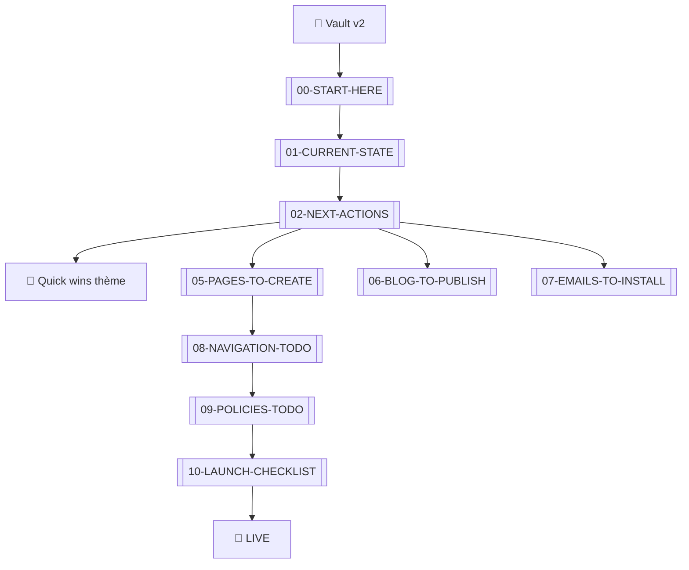

# 🏛 Vault v2 — AURÉLIA

Documentation à jour de la boutique **AURÉLIA Paris** (1er juin 2026).
Snapshot après ~6 heures de travail d'installation, ~70 % du chemin parcouru.

## ⚡ Démarrage rapide

**Si tu reprends le projet ailleurs (autre session Claude, autre développeur)** :

→ Commence par [[00-START-HERE]]

## 📚 Table des matières

| Doc | Contenu | Quand le lire |
|---|---|---|
| [[00-START-HERE]] | Brief 5-min : où on en est, où il faut aller | EN PREMIER |
| [[01-CURRENT-STATE]] | État exact de la boutique Shopify | Pour savoir ce qui est déjà fait |
| [[02-NEXT-ACTIONS]] | Checklist priorisée de ce qui reste | Pour planifier la session |
| [[03-CREDENTIALS-AND-ACCESS]] | URLs, comptes, tokens | Pour se connecter |
| [[04-THEME-SECTIONS-TODO]] | État des sections du thème | Pour customiser le Theme Editor |
| [[05-PAGES-TO-CREATE]] | 14 pages à créer (titres, handles, templates) | Pour créer les pages |
| [[06-BLOG-TO-PUBLISH]] | Blog Journal + 13 articles à publier | Pour publier le blog |
| [[07-EMAILS-TO-INSTALL]] | 5 emails transactionnels | Pour installer les emails |
| [[08-NAVIGATION-TODO]] | Menu header + footer | Pour configurer la nav |
| [[09-POLICIES-TODO]] | Politiques boutique (CGV, RGPD, etc.) | Pour la conformité légale |
| [[10-LAUNCH-CHECKLIST]] | Checklist finale avant lancement réel | À la fin avant de communiquer |

## 🗺 Carte mentale de la mission

## 🎯 Objectif

**Finir l'installation Shopify pour qu'AURÉLIA Paris soit vendable.**

Restant estimé : ~90 minutes de travail manuel + conversion forfait payant
pour encaisser vraiment.

## 🔗 Docs de référence v1 (ancien vault)

Toujours valides comme référence générale :
- `vault/BRAND-CARD.md` — palette, typo, voix éditoriale
- `vault/PRODUCT-CATALOG.md` — catalogue produits exhaustif
- `vault/CONTENT-INDEX.md` — index des contenus rédigés
- `vault/SHOPIFY-RUNBOOK.md` — runbook complet (mais avec étapes déjà faites)

## 🚦 État global

| Catégorie | Statut |
|---|---|
| Identité marque | ✅ 100 % |
| Thème Shopify uploadé | ✅ 100 % |
| Produits (5) créés | ✅ 100 % |
| Photos AI uploadées | ✅ 95 % (1 swap à faire) |
| Collection | ✅ 100 % |
| Codes promo | ✅ 100 % |
| Paiements (mode test) | ✅ 100 % |
| Livraison | ✅ 100 % |
| **Customisation thème** | ⏳ 50 % (sections à finir) |
| **Pages (14)** | ❌ 0 % (à créer) |
| **Blog (13 articles)** | ❌ 0 % (à publier) |
| **Emails (5)** | ❌ 0 % (à coller) |
| **Politiques** | ❌ 0 % (à configurer) |
| **Menu navigation** | ⏳ 30 % (à compléter) |
| **Conformité légale** | ⚠️ 60 % (faux avis à retirer, SIRET à ajouter) |
| **Forfait payant** | ❌ 0 % (à convertir pour vendre) |

**Global** : ≈ **70 %** du chemin parcouru.
